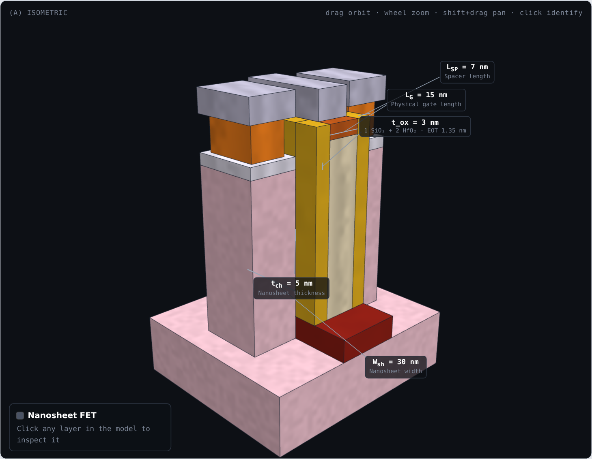
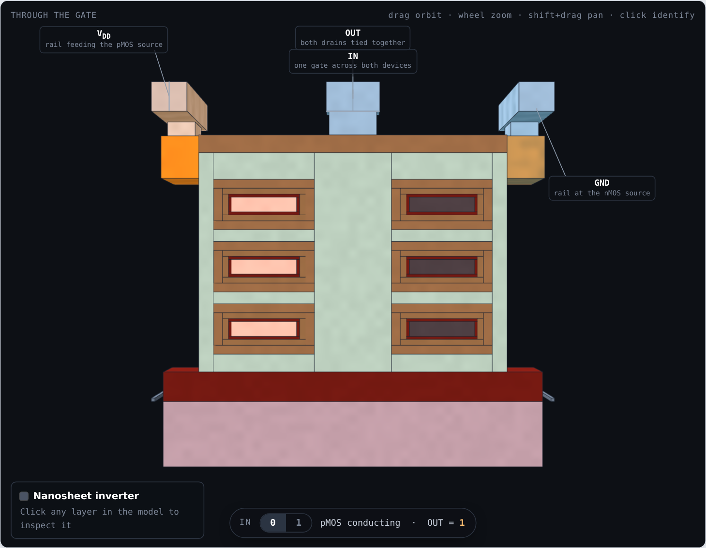
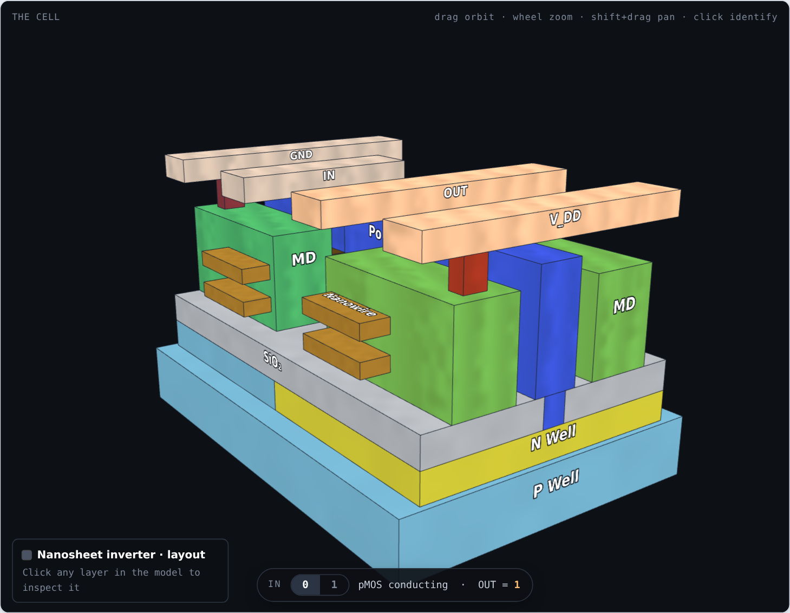
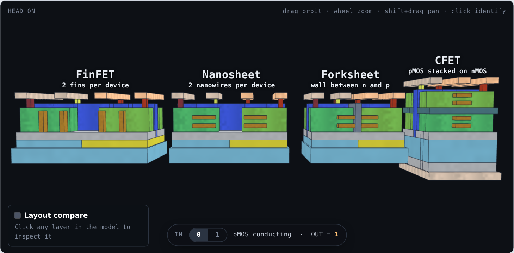

<div align="center">


# FET Lab

**Logic device architectures in 3D — FinFET, nanosheet, forksheet and CFET, film by film.**

[](../../actions/workflows/android.yml)
[](LICENSE)
[](android/app/build.gradle.kts)
[](https://kotlinlang.org)

</div>

---



Every film is modelled: the silicon channel, the 1 nm interfacial oxide, the high-κ HfO₂,
the TiN work-function metal, the gate fill, the spacers, the source/drain epitaxy, the
silicide and the contacts. Slice along any axis and the cut face is **solid**, not hollow,
so a section reads like a real cross-section rather than a shell.

**1 unit = 1 nm.** `x` = source→drain, `y` = vertical stacking, `z` = cell width (n→p).

## Three ways to look at them

| | |
|---|---|
| **Device** | Technical cross-sections of each architecture — section planes, exploded view, tap-to-identify. |
| **Inverter** | A complete CMOS standard cell in each architecture. Drive the input and the conducting path lights up. |
| **Layout** | The same inverter as a labelled layout figure — P Well, N Well, SiO₂, nanowire, MD, Po, VD, VG, Metal 0 — at the cell's real rail-to-rail width, on a uniform Metal 0 track pitch. |

<table>
<tr>
<td width="50%"><br><sub><b>Inverter</b> — pMOS conducting, nMOS dimmed</sub></td>
<td width="50%"><br><sub><b>Layout</b> — the figure, extruded, and drawn to scale</sub></td>
</tr>
</table>



## What it shows

- **Why the FinFET ended.** The gate reaches three faces of a standing fin, never the
  bottom, and drive arrives in whole fins — one more fin costs a whole fin pitch of cell.
- **Why the nanosheet replaced it.** Lay the fin on its side, slice it: gate on four faces,
  width continuous. At a 21 nm sheet pitch only **4 nm** of Mo survives between adjacent
  TiN shells — that gap is the next wall.
- **What the forksheet buys.** A dielectric wall replaces the gap between the n and p
  work-function metals. The price is the fourth gate face.
- **What the CFET costs.** One device wide, but GND has to arrive from the back of the
  wafer and the output has to climb past the tier isolation.

Two comparison scenes put the numbers side by side, and they disagree — which is the point:

| | Device footprint | Inverter cell, rail to rail |
|---|---|---|
| FinFET | 114 nm — 100% | 156 nm — 100% |
| Nanosheet | 92 nm — 81% | 136 nm — 87% |
| Forksheet | 64 nm — 56% | 106 nm — 68% |
| CFET | 34 nm — 30% | 74 nm — 47% |

The Layout figures are drawn at those same cell widths, so the two comparison scenes
agree rather than telling different stories. Cell width shrinks about half as much as
device footprint, because power rails and the routing they need do not scale with the
transistor. Published node figures behave the same
way — imec quotes roughly 5T → 4.3T for the forksheet, and CFET is generally credited with
a 1.5–2× area gain rather than the 3× the device footprint alone suggests.

## Repository layout

```
android/    Native app — Kotlin, Jetpack Compose, hand-written OpenGL ES 2.0 renderer
pwa/        Installable web app, works offline
web/        Desktop viewers, standalone HTML
models/     Every scene exported as GLB / STL / OBJ
scripts/    The parametric generators
data/       devices.json — the box list the app, the viewers and the exporters all read
store/      Play Store assets and listing copy
docs/       Screenshots and the written background
```

## Build the app

```bash
cd android
./gradlew assembleDebug      # → app/build/outputs/apk/debug/
./gradlew installDebug       # straight onto a connected device
```

JDK 17, Android SDK 35, minSdk 26. No third-party 3D library — the renderer, section
capping, ray picking and exploded view are all in `Renderer.kt`.

Publishing: see [`android/PLAY_STORE.md`](android/PLAY_STORE.md).

## Run the web version

```bash
cd pwa && python3 -m http.server 8000
```

Open it on a phone on the same network and use **Add to Home screen** — it installs
standalone and works offline afterwards. The `pages.yml` workflow deploys the same folder
to GitHub Pages if you enable it.

## Regenerate the geometry

Do not hand-edit `data/devices.json`; it is generated.

```bash
pip install trimesh numpy
python scripts/build_devices.py      # device scenes, full film stack
python scripts/build_inverters.py    # inverter cells
python scripts/build_showcase.py     # layout figures, and the node labels
python scripts/build_story.py        # the written background, attached to every scene
python scripts/build_web.py          # roadmap.html + pwa/index.html, from the template
python scripts/export_all.py         # GLB / STL / OBJ
python scripts/mkicon.py             # icons, from icon_src.png
python scripts/verify.py             # audit every scene before shipping
cp data/devices.json android/app/src/main/assets/devices.json
```

Every scene must tile exactly — no overlapping solids, no gaps. The build prints
`max/voxel=1` when it does; `scripts/findlap.py` names the offending pair when it does not.

## Background

[docs/BACKGROUND.md](docs/BACKGROUND.md) is the written history behind each architecture —
what it replaced, what broke, why the industry moved, and what the move cost. The same text
appears in the app.

## Caveats

- Dimensions are representative teaching values, not any foundry's process data.
- The `Node` row is a generation label, not a measurement. Since roughly the 90 nm
  generation the number in a node name has matched no dimension on the wafer; it sits next
  to the physical gate length in the table so the gap between the two is visible.
- The inverter cells route on one metal level plus local interconnect — the topology, not a
  layout you could tape out.
- The forksheet modelled is the classic inner-wall device; imec's later outer-wall variant
  is not included.
- In the plane of the wafer every scene is to scale: gate length, contacted length,
  channel width, cell width and Metal 0 track pitch all come from one set of constants in
  `build_devices.py`, so the same nanometre means the same thing in the Device,
  Inverter and Layout scenes. `verify.py` fails the build if a callout ever disagrees
  with the geometry it points at.
- Vertically, layer thicknesses in the Layout scenes are exaggerated. Drawn to scale, a
  1 nm interfacial oxide would be sub-pixel on a phone. The Device scenes keep the real
  film thicknesses in all three axes.

## Publishing this repository

The bundle already contains a git repository with one commit authored as
`Khandaker Ehsanul Karim <ehsan.pappu.99@gmail.com>`. Create an empty repository named
**fet-lab** on GitHub (no README, no licence — this one has them), then:

```bash
git remote add origin https://github.com/ehsanul-karim-pappu/fet-lab.git
git push -u origin main
```

Then, in the repository settings: **Pages → Source: GitHub Actions** publishes `pwa/` to
`https://ehsanul-karim-pappu.github.io/fet-lab/` on every push. The Android workflow builds a
debug APK on each push and attaches it to the run as an artifact.

If you name the repository something other than `fet-lab`, change `REPO` and `SLUG` in
`android/app/src/main/java/io/github/ehsanulkarimpappu/fetlab/AppInfo.kt` to match — the
About screen, the issue link and the privacy-policy URL Play asks for all derive from them.

## Releases

Version history and what changed in each release: [CHANGELOG.md](CHANGELOG.md).
Builds are on the [releases page](../../releases).

## Contributing

Issues and pull requests welcome — see [CONTRIBUTING.md](CONTRIBUTING.md).
Bug reports go to the [issue tracker](../../issues).

## Licence

[MIT](LICENSE) © 2026 Khandaker Ehsanul Karim
Third-party notices in [THIRD_PARTY.md](THIRD_PARTY.md) · Privacy policy in [PRIVACY.md](PRIVACY.md)

---

<div align="center">
<sub>Built by <b>Khandaker Ehsanul Karim</b> · <a href="mailto:ehsan.pappu.99@gmail.com">ehsan.pappu.99@gmail.com</a></sub>
</div>
