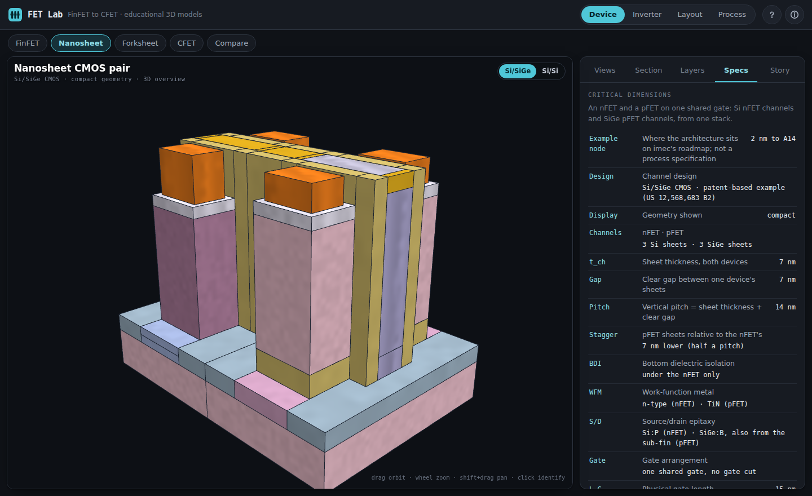
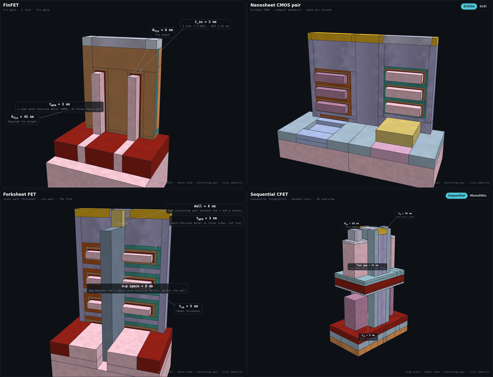
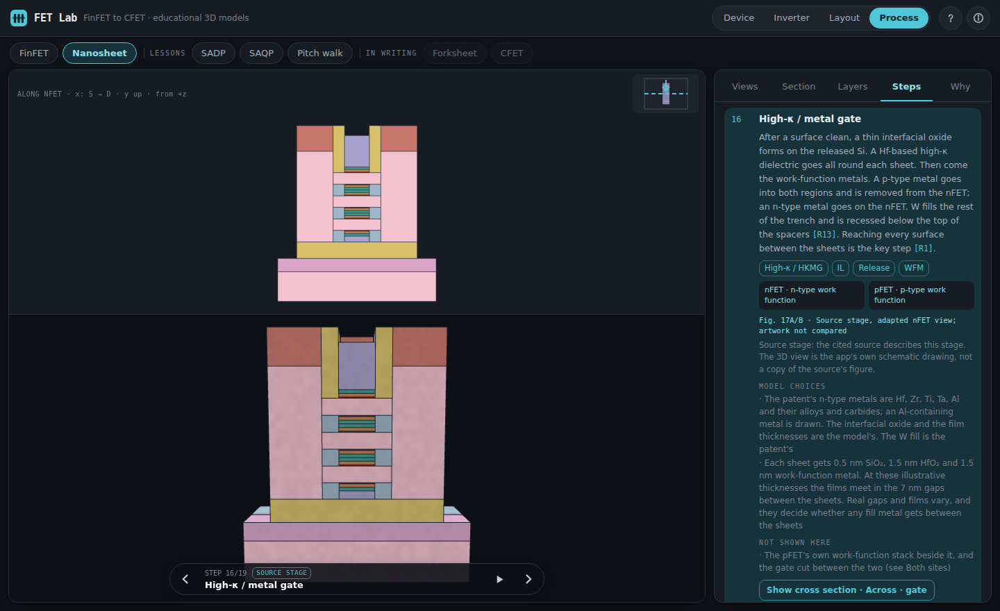
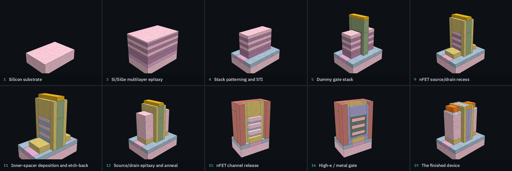
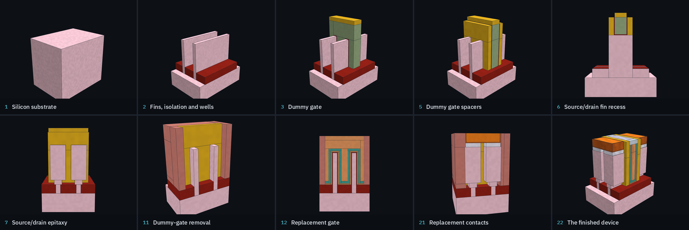
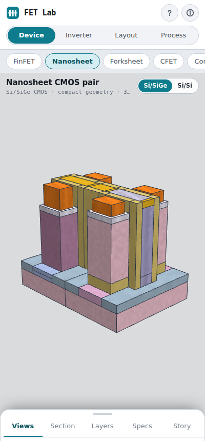

<div align="center">


# FET Lab

**Transistor architectures in 3D: FinFET, nanosheet, forksheet and CFET, film by film, and how they are made.**

[](../../actions/workflows/android.yml)
[](LICENSE)
[](android/app/build.gradle.kts)
[](https://kotlinlang.org)

**[Open it in your browser →](https://ehsanul-karim-pappu.github.io/fet-lab/)**
No install; add it to your home screen and it works offline. An Android app has the same
content.

</div>

---



FET Lab is an educational viewer for the transistor architectures of the logic roadmap. Every
model is real 3D geometry, built from boxes in nanometres: the channels, the gate films (an
interfacial oxide, a high-κ dielectric, the work-function metals), the gate fill, the spacers,
the source/drain epitaxy and the contacts. Cut a model open and the cut face is solid, so it
reads like a real cross-section.

Each architecture follows a published patent for its materials and its order of steps, and every
claim in the text cites its source. Tap a citation such as [R13] to open that reference.

> **Built with AI.** FET Lab is built by its developer working with AI assistance. The models,
> the fabrication steps and the text are checked against the cited sources, but mistakes can
> still slip through. If something looks wrong (a layer, a dimension, a step or a citation),
> please [open an issue](../../issues) so it can be fixed for everyone.

## Contents

- [The architectures](#the-architectures)
- [Four modes](#four-modes)
- [Tools for studying](#tools-for-studying)
- [Get it](#get-it)
- [What the models are, and are not](#what-the-models-are-and-are-not)
- [Sources and documentation](#sources-and-documentation)
- [Build and develop](#build-and-develop)
- [Contributing, privacy and licence](#contributing-privacy-and-licence)

## The architectures



| Architecture | What it shows | Follows |
|---|---|---|
| **FinFET** | A tri-gate nFET with two fins: the gate on three faces of each fin, sized in whole fins. | TSMC, US 9,812,358 B1 |
| **Nanosheet** | A CMOS pair of gate-all-around stacks, in two channel designs picked on the stage: **Si/SiGe** (Si nFET and SiGe pFET sheets from one stack) and **Si/Si** (Si sheets in both, with full bottom isolation). | IBM, US 2023/0420457 A1 (US 12,568,683 B2); IBM, US 2023/0178617 A1 |
| **Forksheet** | The classic inner-wall forksheet: n and p sheet stacks either side of one dielectric wall, each sheet gated on three faces, and a partition wall splitting the contacts. | imec, EP 3 989 273 A1 |
| **CFET** | The pFET stacked under the nFET, in two integrations: **sequential** (two wafers bonded, the default) and **monolithic** (one stack). | TSMC, US 2024/0413156 A1; IBM, US 11,869,812 B2 |

Each device has a view that opens its defining feature: the FinFET's **Tri-gate**, the
nanosheet's **Gate-all-around** and the forksheet's **The fork** lift the near side off and
cut through the gate, so the gate films can be seen wrapping the channel.

## Four modes

| | |
|---|---|
| **Device** | Each architecture's technical model: preset views, cuts along any axis, the layers pulled apart, layers hidden one by one or by group, tap any layer to name it, and the critical dimensions and design notes in Specs. **Compare** sets the four side by side. |
| **Inverter** | Each Device model wired as a CMOS inverter by one metal level. Set the input to 0 or 1 and the conducting path lights up; the colours show ideal logic states, not simulated currents. |
| **Layout** | Schematic inverter cells with simplified film stacks, to scale in the plane of the wafer, with their layers named by role (source/drain contact, gate, vias, Metal 0). Compare puts the four cells at one scale. |
| **Process** | How the devices are made, step by step, as real geometry, from bare silicon to the finished Device model. |

<table>
<tr>
<td width="50%"><br><sub><b>Inverter</b> · the nanosheet pair wired as an inverter</sub></td>
<td width="50%"><br><sub><b>Layout</b> · the FinFET cell, with its layers named by role</sub></td>
</tr>
</table>

### Process mode



- **Lessons:** the **FinFET** and both **nanosheet** designs, from the substrate to the finished
  Device and Inverter scenes. The forksheet and CFET lessons are being written.
- **Sites:** the FinFET and Si/SiGe nanosheet lessons follow the nFET, the pFET, or both sites
  together, ending in a gate cut or a shared gate.
- **Patterning:** the nanosheet's stack lines and the FinFET's fins can be printed directly or by
  SADP or SAQP. The **SADP**, **SAQP** and **Pitch walk** chips show those routes on their own,
  and Pitch walk lets the SAQP dimensions vary to show how pitch walk arises.
- **Each step** says what it shows, which source it follows and how closely (its badge), what the
  model chose for itself, and what it leaves out. The films grow, etch and polish as you step.
- **Section planes:** named planes show a 2D section beside, or above, the 3D view, with a locator
  showing where the plane runs. Tap a layer in the section to name it.
- **Why** explains why the steps come in the order they do.

**The Si/SiGe nanosheet, from the bare wafer to the finished device** (ten of its 19 main steps,
numbered as in the app):



**The FinFET, the same way** (ten of its 22 main steps):




## Tools for studying

- **Guided tour:** on first launch, an animated hand shows each gesture and tool. A separate
  Process tour runs the first time Process is opened. Replay either from **?** (Help).
- **Help:** a list of everything the app can do (each entry opens where that feature lives), a
  suggested order to learn the devices in, and a glossary of the terms the steps use.
- **Story:** the history behind each architecture, what it replaced and what the move cost.
- **Citations:** every [Rn] in the text opens About at that reference, with its link and what it
  supports.
- **Theme:** the app and the page follow the system's light or dark theme.
- **Layout:** on a wide window, the stage sits beside a tabbed panel; on a phone, a sheet slides up
  over the stage. In the app the sheet can be made see-through.



## Get it

- **Web:** [ehsanul-karim-pappu.github.io/fet-lab](https://ehsanul-karim-pappu.github.io/fet-lab/).
  Add it to your home screen to install it; it then works offline.
- **Android:** builds are attached to the [releases](../../releases); a Play Store listing is on
  the way. The app needs no internet permission and collects no data.

## What the models are, and are not

- **Teaching geometry, not foundry data.** Dimensions are representative teaching values within
  the patents' ranges where they give them. Materials follow the patents; where a patent names
  none, the model's choice is labelled as such. Nothing is any foundry's process data or PDK.
- **One roadmap, not the roadmap.** FinFETs remain in use, and the example-node labels do not
  assign an architecture to one node. Modern node names do not specify a physical feature size.
- **Process is a teaching sequence.** It follows one disclosed route per device and names, at every
  step, the source and how closely the state follows it. None of it is a foundry recipe or a copy
  of a published drawing; a 2D section is cut from the app's own model.
- **Logic, not simulation.** Inverter colours show ideal logic states. Work-function tuning, doping,
  strain, self-heating and electrical drive are not simulated.
- **To scale in the plane.** Gate length, contacted length, channel width, cell width and Metal 0
  pitch come from one set of constants, so a nanometre means the same in Device, Inverter and
  Layout; `verify.py` fails the build if a callout disagrees with its geometry. Vertically, the
  Layout scenes are simplified and not to scale; the Device scenes keep real film thicknesses.
- **Comparisons are drawn spans**, not equal-performance area claims. The rail-to-rail span is what
  standard-cell design calls cell height.
- **Units:** 1 unit = 1 nm. `x` runs source → drain, `y` up the stack, `z` across the n/p span.
- **No affiliation.** FET Lab is not affiliated with or endorsed by any company or institution it
  cites; their names only identify the sources.

## Sources and documentation

| Document | What it holds |
|---|---|
| [Patent alignment](docs/PATENT_ALIGNMENT.md) | Each technology's patent, what it says, and what the model draws or chooses itself |
| [Technical references](docs/TECHNICAL_REFERENCES.md) | Every reference the app cites, with its link and what it supports (generated) |
| [Process audit](docs/PROCESS_AUDIT.md) | Every Process step against its source, figure by figure (generated) |
| [Background](docs/BACKGROUND.md) | The history behind each architecture; the same text as the app's Story (generated) |
| [Content audit](docs/CONTENT_AUDIT.md) | An earlier numerical audit of the models |
| [Changelog](CHANGELOG.md) | What changed in each release |

The patent documents are linked from their references rather than kept in this repository.

## Build and develop

```
android/    The native app: Kotlin, Jetpack Compose, a hand-written OpenGL ES 2.0 renderer
pwa/        The installable web app (deployed to GitHub Pages)
web/        The same page as one standalone HTML file, plus an older nanosheet-only viewer
scripts/    The parametric builders, the web template, and the checks
data/       Generated: devices.json (every scene), process.json (the lessons),
            guide.json (tour, help, glossary), references.json
models/     Every scene exported as GLB, STL and OBJ
store/      Play Store icon, feature graphic and listing text
docs/       Screenshots and the documents above
```

**Geometry, lessons and the web page.** Everything the app and the page show is generated; do not
hand-edit `data/`, `web/` or `pwa/index.html`.

```bash
python3 -m pip install numpy           # trimesh too, for the mesh export
python3 scripts/build.py               # every scene, lesson, story, check and bundle
python3 scripts/test_content.py        # content, lesson and reference checks
python3 scripts/export_all.py          # GLB / STL / OBJ into models/
```

Every scene and every Process step must tile exactly, with no overlapping solids: the build
prints `max/voxel=1` when it does, and `scripts/findlap.py` names the offending pair when it
does not.

**The Android app.** JDK 17, Android SDK 35, minSdk 26. No third-party 3D library: the
renderer, section capping, ray picking and layer separation are in `Renderer.kt`.

```bash
cd android
./gradlew assembleDebug      # → app/build/outputs/apk/debug/
./gradlew installDebug       # straight onto a connected device
```

CI builds a debug APK on every push to main and attaches it to the run. Publishing:
[`android/PLAY_STORE.md`](android/PLAY_STORE.md).

**The web app locally.**

```bash
cd pwa && python3 -m http.server 8000
```

## Contributing, privacy and licence

- **Contributing:** issues and pull requests are welcome; see [CONTRIBUTING.md](CONTRIBUTING.md).
  Since the app is built with AI assistance, a report of anything that looks wrong is especially
  welcome on the [issue tracker](../../issues).
- **Privacy:** the app collects no data; see [PRIVACY.md](PRIVACY.md).
- **Licence:** [MIT](LICENSE) © 2026 Khandaker Ehsanul Karim. Third-party notices, including the
  fonts and libraries, are in [THIRD_PARTY.md](THIRD_PARTY.md).

---

<div align="center">
<sub>Built by <b>Khandaker Ehsanul Karim</b> · <a href="mailto:ehsan.pappu.99@gmail.com">ehsan.pappu.99@gmail.com</a></sub>
</div>
