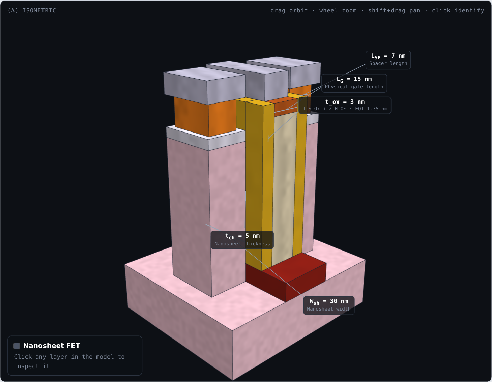
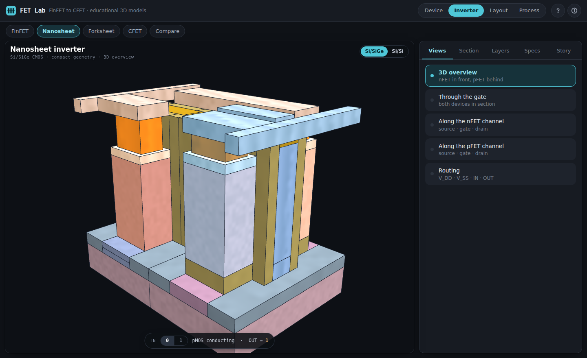
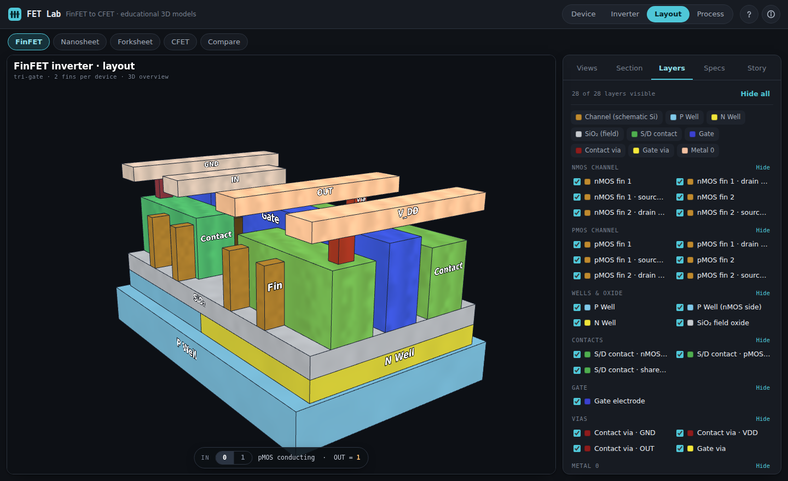
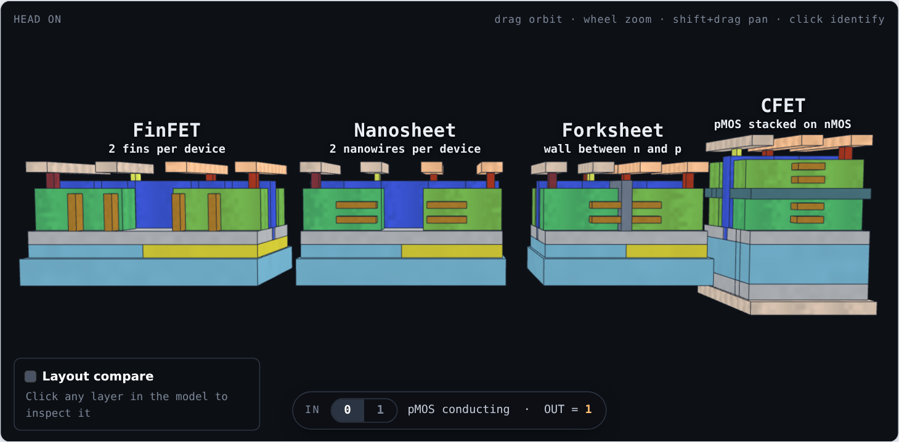

<div align="center">


# FET Lab

**Transistor architectures in 3D — FinFET, nanosheet, forksheet and CFET, film by film.**

[](../../actions/workflows/android.yml)
[](LICENSE)
[](android/app/build.gradle.kts)
[](https://kotlinlang.org)

**[Open it in your browser →](https://ehsanul-karim-pappu.github.io/fet-lab/)**
No install; add it to your home screen and it works offline.

</div>

---



Selected films are modeled: the silicon channel, the 1 nm interfacial oxide, the high-κ HfO₂,
the work-function metal (an Al-containing n-type metal for nFETs, TiN for pFETs), the gate fill, the spacers, the source/drain epitaxy, the
silicide and the contacts. Slice along any axis and the cut face is **solid**, not hollow,
so a section reads like a real cross-section rather than a shell.

**1 unit = 1 nm.** `x` = source→drain, `y` = vertical stacking, `z` = lateral n/p span.

> **Built with AI.** FET Lab is built by its developer working with AI assistance. The models,
> the fabrication steps and the text are checked against the cited sources, but mistakes can
> still slip through. If something looks wrong (a layer, a dimension, a step or a citation),
> please [open an issue](../../issues) so it can be fixed for everyone. The app and the web
> page say the same in About.

## Four ways to look at them

| | |
|---|---|
| **Device** | Technical cross-sections of each architecture: preset views, including one that opens each device's defining feature (the FinFET's Tri-gate, the nanosheet's Gate-all-around, the forksheet's fork), cuts along any axis, layers pulled apart, layers hidden one by one or by group, and tap-to-identify. The nanosheet comes in two channel designs, picked on the stage. |
| **Inverter** | Each architecture's Device model (the FinFET's with its pFET beside it) wired as a CMOS inverter by one metal level. Drive the input and the conducting path lights up. |
| **Layout** | Schematic inverter layouts with simplified film stacks and simplified vertical dimensions (not to scale); two representative nanosheets instead of the technical model's three. |
| **Process** | How a nanosheet FET or a FinFET is made, step by step, as real geometry: films, lithography, etch and fill on a 2 × 2 tile, then the selected site to the finished device, as the nFET, the pFET, or both sites with a gate cut or a shared gate. The stack lines or fins can be printed directly or by SADP or SAQP; a Pitch walk lesson lets the SAQP dimensions vary. Named section planes show a 2D section beside the 3D view (tap a layer to name it, pinch to zoom), and a step's "Show cross section" button opens its plane. Each lesson ends on the Device model it names. The web page has all of it too. Forksheet and CFET flows are coming. |

<table>
<tr>
<td width="50%"><br><sub><b>Inverter</b> — pMOS conducting, nMOS dimmed</sub></td>
<td width="50%"><br><sub><b>Layout</b> — schematic stack, with lateral dimensions to model scale</sub></td>
</tr>
</table>



A guided tour on first launch shows the gestures and every tool, with an animated hand doing
each one, in the app and on the web page; replay it from **?** (Help). Help also has a
Process mode tour, which also runs by itself the first time Process is opened, a list of
everything the app can do, a suggested order to learn the devices in, and a glossary of the
terms the fabrication steps use.

Every citation in the text, such as [R13], opens About at the reference it names, with its
link and what it supports. The stage and the panels follow the system's light or dark theme,
in the app and on the web page. The web page lays out like the app: the stage beside a tabbed
panel on a wide window, a bottom sheet over the stage on a phone.

## What it shows—and what it does not

- FinFET: a tri-gate example with discrete fin-count sizing.
- Nanosheet FET: gate-all-around channels with adjustable sheet width, as a CMOS pair in two
  channel designs, picked on the stage and shared by Device, Inverter and Process: **Si/SiGe CMOS**
  (Si nFET and SiGe pFET sheets from one stack, after US 2023/0420457 A1, granted as
  US 12,568,683 B2) and **Si/Si CMOS** (Si sheets in both with full bottom isolation, after
  application US 2023/0178617 A1), each with its own Process lesson ending on the Device and
  Inverter scenes.
- Forksheet: the classic inner-wall arrangement after imec's EP 3 989 273 A1, not the later
  outer-wall variant.
- CFET: a stacked pair, pFET below the nFET, with a monolithic example (IBM, US 11,869,812 B2)
  and a sequential one (TSMC, US 2024/0413156 A1).

Each technology follows one patent example for its materials and steps; `docs/PATENT_ALIGNMENT.md`
lists them, what each says, and what the model draws. The PDFs are in `docs/`.

This is one educational roadmap, not a universal process sequence. FinFETs remain in use.
Process mode follows one disclosed integration route for the nanosheet nFET and pFET, and
disclosed FinFET stages, as a teaching sequence: each step names the source it follows and
how closely, and none is a foundry recipe or a copy of a published drawing. A 2D section is
cut from the app's own model, not taken from a patent figure. The nanosheet lesson's states
were compared with the drawings they name; the FinFET's figure numbers come from its patent's
text, and the Si/Si lesson places its steps in the application's figure range. The SADP and SAQP routes for the
nanosheet are illustrative alternatives, the FinFET's SAQP is adapted from a published
example, and the pitch-walk variations are the app's own.
Materials and dimensions are illustrative; the complete stack is not a verified foundry
recipe. Work-function tuning, doping, strain, self-heating and electrical drive are not simulated.
IN/OUT colors demonstrate ideal logic states, not current or timing calculations.

Comparison scenes report drawn lateral spans, not equal-performance area comparisons.
The rail-to-rail z dimension is commonly called cell height in standard-cell design.
Gate-stack span, device-pair span and rail-to-rail span are distinct measurements.
The example-node labels do not assign an architecture to one universal technology node.

Each model follows a published patent; where it differs, the step or note says it is the
model's choice. See [patent alignment](docs/PATENT_ALIGNMENT.md), the
[numerical audit](docs/CONTENT_AUDIT.md) and [technical references](docs/TECHNICAL_REFERENCES.md).
Gate-stack thickness and the plotted dimensions can be checked against the box model;
that is not physical validation against manufactured devices.

## Repository layout

```
android/    Native app — Kotlin, Jetpack Compose, hand-written OpenGL ES 2.0 renderer
pwa/        Installable web app, works offline
web/        The same page as one standalone HTML file, plus an older nanosheet-only viewer
models/     Every scene exported as GLB / STL / OBJ
scripts/    The parametric generators
data/       Generated: devices.json (every scene's boxes), process.json (the Process lessons),
            guide.json (tour, help and glossary), references.json; the app, the web page
            and the exporters all read them
store/      Play Store assets and listing copy
docs/       Screenshots and the written background
```

## Build the app

```bash
cd android
./gradlew assembleDebug      # → app/build/outputs/apk/debug/
./gradlew installDebug       # straight onto a connected device
```

JDK 17, Android SDK 35, minSdk 26. No third-party 3D library — the renderer, section
capping, ray picking and exploded view are all in `Renderer.kt`. CI builds a debug APK on
pushes to main and pull requests, and attaches it to the run.

Publishing: see [`android/PLAY_STORE.md`](android/PLAY_STORE.md).

## Run the web version

```bash
cd pwa && python3 -m http.server 8000
```

Open it on a phone on the same network and use **Add to Home screen** — it installs
standalone and works offline afterwards. The `pages.yml` workflow deploys the same folder
to GitHub Pages if you enable it.

## Regenerate the geometry

Do not hand-edit `data/devices.json`; it is generated.

```bash
python3 -m pip install numpy
python3 scripts/build.py             # all scenes, background and viewer assets
python3 scripts/test_content.py      # synchronized bundles and reference coverage
python3 scripts/verify.py            # structural/geometry checks
```

Every scene must tile exactly — no overlapping solids, no gaps. The build prints
`max/voxel=1` when it does; `scripts/findlap.py` names the offending pair when it does not.

## Background

[docs/BACKGROUND.md](docs/BACKGROUND.md) is the written history behind each architecture —
what it replaced, what broke, why the industry moved, and what the move cost. The same text
appears in the app.

## Caveats

- Dimensions are representative teaching values, not any foundry's process data.
- The `Node` row is a generation label, not a measurement. Modern node names do not specify a unique physical feature size. The example labels here are
  illustrative, not a claim that each architecture belongs to one node.
- The inverter cells route on one metal level over the contacts — the topology, not a
  layout you could tape out.
- The forksheet modelled is the classic inner-wall device; imec's later outer-wall variant
  is not included.
- In the plane of the wafer every scene is to scale: gate length, contacted length,
  channel width, cell width and Metal 0 track pitch all come from one set of constants in
  `build_devices.py`, so the same nanometre means the same thing in the Device,
  Inverter and Layout scenes. `verify.py` fails the build if a callout ever disagrees
  with the geometry it points at.
- Vertically, layer thicknesses in the Layout scenes are exaggerated. Drawn to scale, a
  1 nm interfacial oxide would be sub-pixel on a phone. The Device scenes keep the real
  film thicknesses in all three axes.

## Releases

Version history and what changed in each release: [CHANGELOG.md](CHANGELOG.md).
Builds are on the [releases page](../../releases).

## Contributing

Issues and pull requests welcome — see [CONTRIBUTING.md](CONTRIBUTING.md).
Bug reports go to the [issue tracker](../../issues). Since the app is built with AI assistance,
a report of anything that looks wrong is especially welcome.

## Licence

[MIT](LICENSE) © 2026 Khandaker Ehsanul Karim
Third-party notices in [THIRD_PARTY.md](THIRD_PARTY.md) · Privacy policy in [PRIVACY.md](PRIVACY.md)

---

<div align="center">
<sub>Built by <b>Khandaker Ehsanul Karim</b> · <a href="mailto:ehsan.pappu.99@gmail.com">ehsan.pappu.99@gmail.com</a></sub>
</div>
